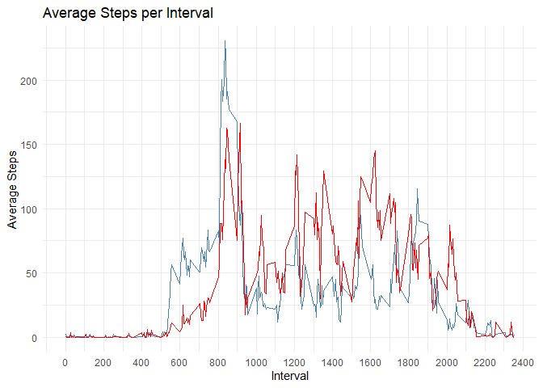

## Loading and preprocessing the data

``` r
# Load necessary libraries
library(dplyr)
library(ggplot2)
library(lubridate)
library(gridExtra)

# Load the dataset
activity_data <- read.csv(here::here("data", "activity.csv"))
# Convert date column to Date type
activity_data$date <- as.Date(activity_data$date)

# Check the structure of the dataset
str(activity_data)
```

```
## 'data.frame':	17568 obs. of  3 variables:
##  $ steps   : int  NA NA NA NA NA NA NA NA NA NA ...
##  $ date    : Date, format: "2012-10-01" "2012-10-01" ...
##  $ interval: int  0 5 10 15 20 25 30 35 40 45 ...
```

``` r
# Check for missing values
sum(is.na(activity_data))
```

```
## [1] 2304
```

## What is mean total number of steps taken per day?

``` r
# Calculate total steps per day
total_steps_per_day <- activity_data %>%
  group_by(date) %>%
  summarise(total_steps = sum(steps, na.rm = TRUE))

head(total_steps_per_day)
```

```
## # A tibble: 6 × 2
##   date       total_steps
##   <date>           <int>
## 1 2012-10-01           0
## 2 2012-10-02         126
## 3 2012-10-03       11352
## 4 2012-10-04       12116
## 5 2012-10-05       13294
## 6 2012-10-06       15420
```

## What is the average daily activity pattern?

``` r
# Calculate average steps per day
average_steps_per_day <- activity_data %>%
  group_by(date) %>%
  summarise(average_steps = mean(steps, na.rm = TRUE))

head(average_steps_per_day)
```

```
## # A tibble: 6 × 2
##   date       average_steps
##   <date>             <dbl>
## 1 2012-10-01       NaN    
## 2 2012-10-02         0.438
## 3 2012-10-03        39.4  
## 4 2012-10-04        42.1  
## 5 2012-10-05        46.2  
## 6 2012-10-06        53.5
```

## Imputing missing values


``` r
# Check for missing values in the dataset and look at distribution of steps
# Use median to impute missing values

missing_steps <- sum(is.na(activity_data$steps))
if (missing_steps > 0) {
  # Impute missing values with the mean of the respective interval
  activity_data_imputed <- activity_data %>%
    group_by(interval) %>%
    mutate(steps = ifelse(is.na(steps), mean(steps, na.rm = TRUE), steps)) %>%
    ungroup()
}

sum(is.na(activity_data_imputed$steps)) # Check if there are still missing values
```

```
## [1] 0
```

## Are there differences in activity patterns between weekdays and weekends?

``` r
# Create a new column to indicate whether the day is a weekday or weekend
activity_data_imputed <- activity_data_imputed %>%
  mutate(day_type = ifelse(wday(date) %in% c(1, 7), "Weekend", "Weekday"))

# Calculate average steps per interval for weekdays and weekends
average_steps_weekday <- activity_data_imputed %>%
  filter(day_type == "Weekday") %>%
  group_by(interval) %>%
  summarise(average_steps = mean(steps, na.rm = TRUE))

average_steps_weekend <- activity_data_imputed %>%
  filter(day_type == "Weekend") %>%
  group_by(interval) %>%
  summarise(average_steps = mean(steps, na.rm = TRUE))

head(average_steps_weekday)
```

```
## # A tibble: 6 × 2
##   interval average_steps
##      <int>         <dbl>
## 1        0        2.25  
## 2        5        0.445 
## 3       10        0.173 
## 4       15        0.198 
## 5       20        0.0990
## 6       25        1.59
```

``` r
head(average_steps_weekend)
```

```
## # A tibble: 6 × 2
##   interval average_steps
##      <int>         <dbl>
## 1        0       0.215  
## 2        5       0.0425 
## 3       10       0.0165 
## 4       15       0.0189 
## 5       20       0.00943
## 6       25       3.51
```

## Plotting the results

After performing the calculations and imputations, we can visualize the results to better understand the activity patterns.

### Histogram of the total number of steps taken each day

``` r
#impoutre missing value and repeat the plot
activity_data_imputed <- activity_data_imputed %>%
  group_by(date) %>%
  summarise(total_steps = sum(steps, na.rm = TRUE))

# Plot the histogram of total steps per day
grid.arrange(
ggplot(total_steps_per_day, aes(x = total_steps)) +
  geom_histogram(binwidth = 1000, fill = "blue", color = "black") +
  labs(title = "Total Steps per Day", x = "Total Steps", y = "Frequency") +
  theme_minimal(),

ggplot(activity_data_imputed, aes(x = total_steps)) +
  geom_histogram(binwidth = 1000, fill = "steelblue", color = "black") +
  labs(title = "Total Steps per Day imputed", x = "Total Steps", y = "Frequency") +
  theme_minimal(),
ncol = 2
)
```

<!-- -->

### Time series plot of the average number of steps taken

### Plot the average daily activity pattern

``` r
# Plot the total steps per day
ggplot(total_steps_per_day, aes(x = date, y = total_steps)) +
  geom_line(color = "blue") +
  labs(title = "Total Steps per Day", x = "Date", y = "Total Steps") +
  theme_minimal()
```

<!-- -->

``` r
#save in figures
ggsave("figures/total_steps_per_day.png", width = 8, height = 6)
```

### Plot the average steps per interval for weekdays and weekends

``` r
# Plot the average steps per interval for weekdays and weekends
ggplot() +
  geom_line(data = average_steps_weekday, aes(x = interval, y = average_steps), color = "steelblue") +
  geom_line(data = average_steps_weekend, aes(x = interval, y = average_steps), color = "red") +
  labs(title = "Average Steps per Interval", x = "Interval", y = "Average Steps") +
  scale_x_continuous(breaks = seq(0, 2400, by = 200)) +
  theme_minimal() +
  theme(legend.position = "top") +
  scale_color_manual(values = c("Weekday" = "steelblue", "Weekend" = "red"))
```

<!-- -->

``` r
# Save the plot
ggsave("figures/average_steps_per_interval.png", width = 8, height = 6)
```
